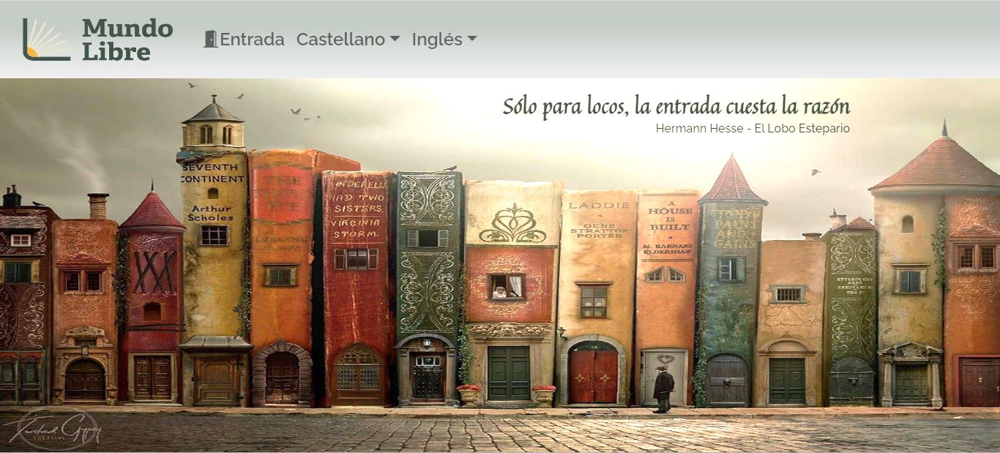

# **Mundo Libre - Bookstore**

**Mundo Libre** es mi primer proyecto con React y en él quise reflejar uno de mis hobbies, la lectura.

En su stock podrás encontrar mis libros favoritos entre otros que no me gustaron tanto y aquellos que conforman mi lista de pendientes.

Como todo libro, posee una portada o puerta de entrada al mundo de la lectura, que nos exige liberar nuestra mente y abrirnos a lo que cada libro tenga para ofrecer.

Fue construido con **Create React App** e incluye elementos de **Bootstrap**.

La base de datos fue creada en **Firestore Database** y las imágenes almacenadas en el **Storage** de **Firebase**.

Link a la página: https://regal-squirrel-0c6155.netlify.app/  🚀 

✒️ Lorena Carla Di Stefano

